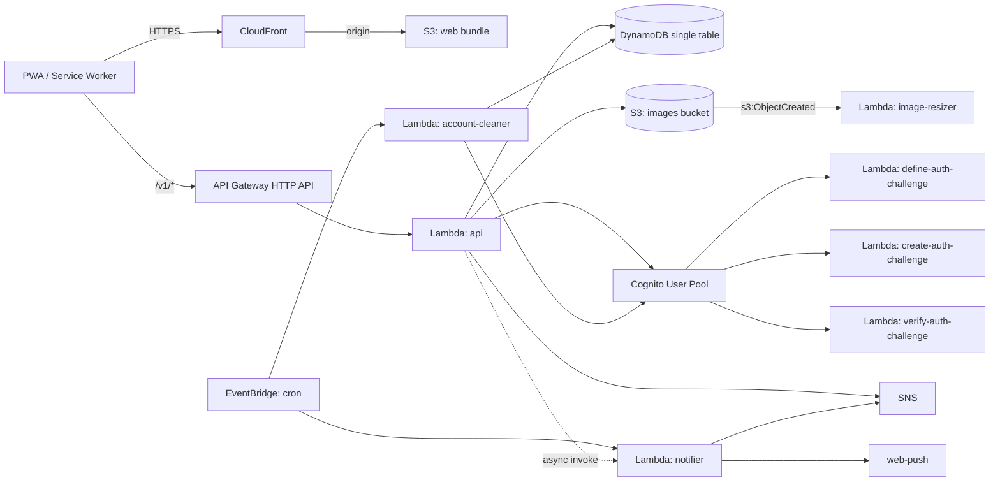

# Garage Borrow

> Lend what you have. Borrow what you need. An open-source neighborhood gear-sharing PWA.

Garage Borrow is a multi-tenant PWA for neighborhood tool libraries. Each "garage" is a tenant — Lebanon Garage (Lebanon, IN) is the first deployed instance. Phone-only auth, no money handling, runs on a shoestring AWS bill.

## Screenshots

> _Screenshots coming after launch — capture from a deployed instance and drop into `docs/screenshots/` to wire them in._

## Why

Neighbors already share tools — informally, in texts and group chats. The bookkeeping is the friction: who has what, when did they take it, did they remember to bring it back. Garage Borrow gives that the lightest possible app: a pegboard you can browse, borrow from, and return to without an account email or a credit card. No payments, no fees, no insurance attestations.

It's open source so any neighborhood, church, or community group can stand up its own instance for their own people. A single tenant can run for under $5/month on AWS — concrete number, hard constraint, see the cost section.

The primary user is "one person with a generous garage and several dozen friends." If that's you, this is built for you. The deliberate non-goals are:

- No money handling. Nothing changes hands financially. There are no fees, no rentals, no payouts.
- No formal verification. Phone-number sign-up is the whole identity story. Trust is social, scoped per-garage, expressed via tier promotions.
- No native app. PWA installs cleanly to iOS and Android home screens with custom splash, theme color, and app shortcuts.

## Quick start

Prerequisites: Node 20 (`.nvmrc`), pnpm 9, AWS CLI + SAM CLI configured for `us-east-2`.

```bash
pnpm install
pnpm dev          # starts the web app on http://localhost:5173
pnpm dev:api      # starts the API in watch mode
pnpm build        # builds every package + app
pnpm lint         # eslint
pnpm typecheck    # tsc --noEmit across the workspace
pnpm test         # vitest
make validate     # sam validate --lint
make deploy-guided  # one-command deploy of the full stack
```

## Architecture

```
apps/
  web/          Vite + React 18 + TypeScript + Tailwind + Framer Motion + vite-plugin-pwa
  api/          Hono on AWS Lambda, esbuild-bundled, behind API Gateway HTTP API
packages/
  shared/       Zod schemas, domain types, DynamoDB key encoders/decoders
  ui/           Shared React components (extracted later for native reuse)
infra/          AWS SAM template
scripts/        Utility scripts (icon export, OG image, VAPID gen, garage seed)
docs/           Project documentation
.github/
  workflows/
    ci.yml      lint, typecheck, test, build, lighthouse on PR + main
    deploy.yml  SAM deploy on push to main (AWS via OIDC)
```



## Cost

Target: under $5/month at small scale (one neighborhood, dozens of items, hundreds of borrows/month).

| Service                       | Estimated monthly cost                     |
| ----------------------------- | ------------------------------------------ |
| DynamoDB (on-demand)          | ~$0 — well under free-tier read/write caps |
| Lambda (api + 3 background)   | ~$0 — stays in free tier at small scale    |
| API Gateway HTTP API          | ~$1                                        |
| CloudFront (price class 100)  | ~$0 — free tier covers this easily         |
| S3 (images + static web)      | ~$0                                        |
| Cognito SMS (≈50 sign-ins/mo) | ~$0.50                                     |
| Route 53 hosted zone          | $0.50                                      |
| **Total**                     | **~$2/month**                              |

The choices that keep it cheap:

- HTTP API instead of REST API ($1.00/M vs $3.50/M)
- DynamoDB on-demand (no provisioned floor)
- CloudFront price class 100 (US/CA/EU edges only)
- No NAT gateway, no VPC, no Aurora, no ElastiCache (saves $32/mo on NAT alone)
- arm64 Lambda (20% cheaper per ms than x86)

## Configuration

Environment variables consumed at deploy time:

| Variable                 | Where       | Default        | Notes                                         |
| ------------------------ | ----------- | -------------- | --------------------------------------------- |
| `VITE_TENANT_NAME`       | web build   | Lebanon Garage | Long form for the manifest + page chrome      |
| `VITE_TENANT_SHORT_NAME` | web build   | Garage         | Short form for the home-screen icon label     |
| `VITE_API_BASE_URL`      | web build   | `/v1`          | Override only if API is on a different origin |
| `VITE_SENTRY_DSN`        | web build   | unset          | Optional. When unset, Sentry init is a no-op  |
| `SENTRY_DSN`             | API Lambdas | unset          | Same — set via `SentryDsn` SAM parameter      |
| `STAGE`                  | API Lambdas | dev            | `dev` or `prod`                               |

Per-tenant customizations live on the `Garage` record in DynamoDB:

- **Tier labels** — `howdy` / `friend` / `family` are the defaults; can be re-skinned per tenant.
- **Pay-it-forward orgs** — `payforward_orgs[]` list of nonprofits members can route a "thank you" donation to.
- **Quality tiers** — defaults to `good` / `great` / `perfect` for donation grading.

## Roadmap

- ✅ **Phase A — v1.0** — lending (instances, reservations, waitlist, returns), tier-based access, donations + pay-it-forward, image upload + auto-resize, push + SMS + in-app notifications, account deletion + 30-day undo, audit log, admin console.
- ⏳ **Phase B — future** — visit / workshop scheduling time-slots, AI assistant ("Ask Dad's Garage"), wishlist, native app shells (iOS + Android), broader multi-tenant onboarding flow.

## Deploy

First-time deploy uses guided SAM:

```bash
make build           # bundles api + builds web + sam build
make deploy-guided   # interactive SAM deploy
```

Subsequent deploys go through GitHub Actions on push to `main` (see `.github/workflows/deploy.yml`). The workflow assumes an AWS IAM role via OIDC — configure `AWS_DEPLOY_ROLE_ARN` as a repo secret.

For the full first-time playbook (domain, ACM, Cognito SMS production approval, VAPID keypair, AWS Budgets, Sentry, owner seed, first inventory), see [docs/deploy.md](./docs/deploy.md). Real-device pre-launch checks are in [docs/smoke-test.md](./docs/smoke-test.md).

## Contributing

See [CONTRIBUTING.md](./CONTRIBUTING.md). Code of conduct: [Contributor Covenant 2.1](https://www.contributor-covenant.org/version/2/1/code_of_conduct/) — see [`CODE_OF_CONDUCT.md`](./CODE_OF_CONDUCT.md).

## Security

Every PR opened from a branch in this repository is automatically
reviewed by Claude Code's `/security-review` workflow. PRs from forks
do not run the workflow because GitHub does not expose secrets to
fork-triggered workflows; review those manually before merging.
High-severity findings block merge; medium and low findings are
commented for review. Local pre-push runs are documented in
[CLAUDE.md](./CLAUDE.md).

Found a vulnerability? Email duobrien@gmail.com or open a private
security advisory at
https://github.com/dustinobrien/garageborrow/security/advisories/new.

## License

[MIT](./LICENSE) — Copyright 2026 Dustin OBrien.
